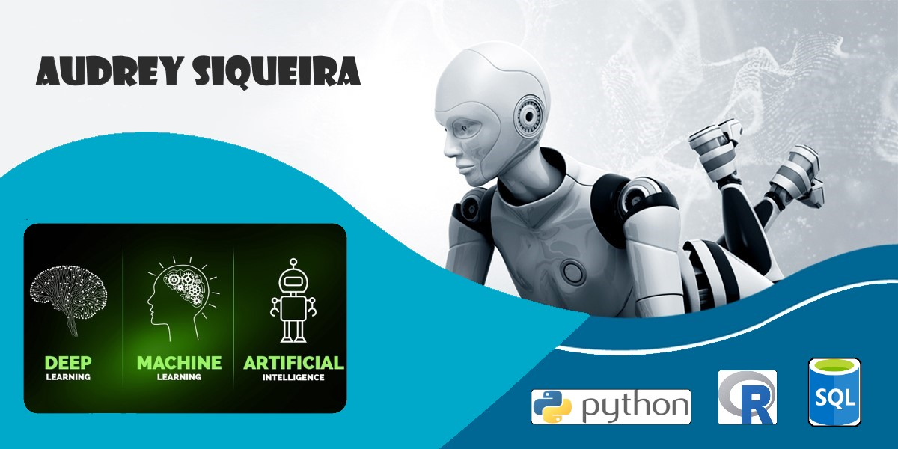

  

# Audrey Siqueira
*Data Scientist* at Bytedance 

Aerospace/Mechanical Engineer with experience in studies related to Artificial Intelligence, Satellites, GNSS and Positioning.
Aiming participation in innovative and technological projects. 

**Background in:** Data Science, Machine Learning, Deep Learning, Python, R and SQL. 
 
 **Links:**
* [Blog]
* [LinkedIn](https://www.linkedin.com/in/audrey-siqueira-b5341ba3/)
* [Medium]

## Data Science Projects:

### Machine Learning:
**Regression**
**Classification**
**Clustering**
**Association Rule Learning**
**Reinforcement Learning**

### Natural Language Processing:
**Bag of Words

### Deep Learning:
**Artificial Neural Network**
**Convolutional Neural Network**

### Dimensionality Reduction:
**Principal Component Analysis**
**Linear Discriminant Analysis**
**Kernel PCA**

### Model Evaluation:
**K-Fold Cross Validation**
**Grid Search**

### XGboost:
**XGboost Algorithm**

